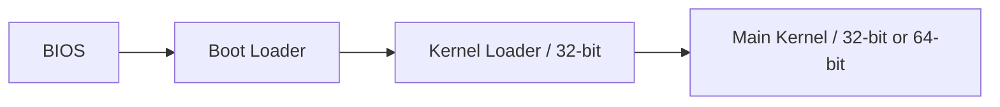

# Booting

This document describes the boot process of Nova on an x86 system. 

## Boot Loader

The boot loader is a small program that is responsible for loading the operating system into memory and starting its execution. The boot loader is typically stored in the first sector of the disk, known as the Master Boot Record (MBR). The BIOS loads the boot loader into memory and transfers control to it. The boot loader then loads the operating system into memory and transfers control to it.

Nova uses the GRUB boot loader which follows the Multiboot Specification. The Multiboot Specification is a standard that defines how the boot loader should load the operating system into memory and transfer control to it.

Specification: [Multiboot Specification](https://www.gnu.org/software/grub/manual/multiboot/multiboot.html)

## Kernel boot

Once control is transferred from the boot loader to the kernel, the rest of the boot process is divided into two stages:
- Kernel loader (32-bit)
- Main kernel (32-bit or 64-bit)

The kernel loader is a small 32-bit program that is responsible for locating the main kernel, decompress it into memory and hand over control to it. The main kernel can be either a 32-bit or 64-bit program. 

If the main kernel is 64-bit, the kernel loader switches the processor to long mode (64-bit) before transferring control.



## Memory Layout

The memory layout of an x86 system is as follows:
```
+------------------+ <- 0xFFFFFFFF (4GB)
|       ...        |
|                  |
|                  |
+------------------+ <- Depends
|  PM Main Kernel  |
|  (32 or 64-bit)  |
+------------------+ <- 0x00200000 (2MB)
| PM Kernel Loader |
|     (32 bit)     |
+------------------+ <- 0x00100000 (1MB)
|  Video/IO memory |
|    Boot Loader   |
|       BIOS       |
+------------------+ <- 0x00000000 (0MB)

PM = Protected-Mode
```
